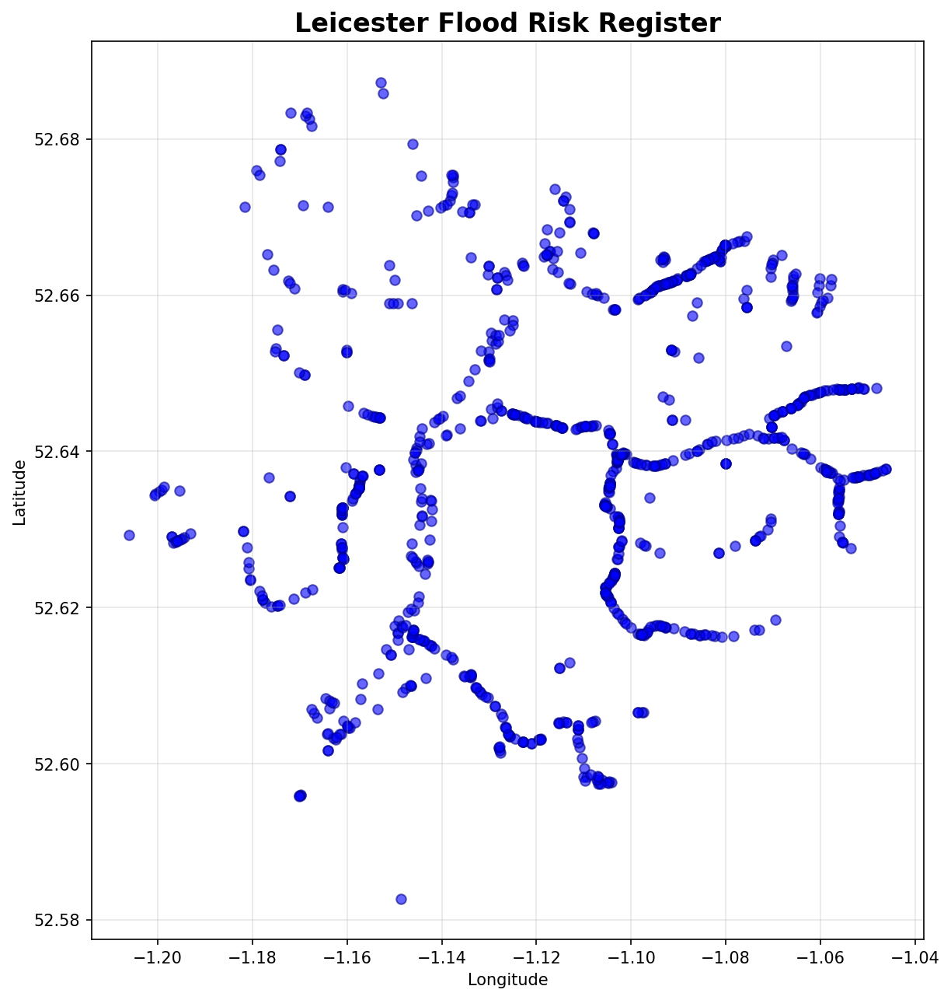

# 📄 **COMPLETE README.md FOR GITHUB DEPLOYMENT**

```markdown
# 🌊 Leicester Flood Risk Dashboard

An interactive web dashboard showcasing flood risk data for Leicester, UK. Combines multiple data sources including Leicester City Council flood structures, Environment Agency historic flood events, and EA Flood Zones with climate change projections.



## 📊 Features

### 🗺️ Interactive Map
- **Leaflet.js** powered interactive map centered on Leicester
- Zoom, pan, and click features for detailed information
- Responsive design (mobile & desktop)

### 📦 3 Data Layers

1. **Leicester Flood Structures** (Blue)
   - 990 flood defense structures and features
   - Includes walls, culverts, and flood protection infrastructure
   - Source: Leicester City Council Open Data

2. **Historic Flood Events** (Red)
   - 127 documented flood events (1946-2025)
   - Click on red circles to see event details
   - Source: Environment Agency Historic Flood Map

3. **EA Flood Zones (CCP1)** (Indigo)
   - Environment Agency Flood Zones with climate change projections
   - **Zone 2:** Medium risk (1 in 1000 - 1 in 100) - Blue
   - **Zone 3:** High risk (1 in 100+) - Dark Blue
   - **Zone 3a:** High risk + Climate Change - Red
   - **Zone 3b:** Functionally Essential Land - Orange
   - Source: Defra Data Services Platform

## 🚀 Quick Start

### Prerequisites
- Python 3.10+
- Node.js (optional, for http-server)
- Modern web browser (Chrome, Firefox, Safari, Edge)

### Installation

```bash
# Clone the repository
git clone https://github.com/rjmlaird/leicester-flood-map.git

# Navigate to project directory
cd leicester-flood-map

# Install Python dependencies (for data preparation)
pip install geopandas pandas

# Prepare data files (run once)
python quick_convert.py
python prepare_historic.py
python prepare_ea_flood_zones.py

# Start local server
cd docs
python -m http.server 8000

# Open in browser
# http://localhost:8000/index.html
```

## 📁 Project Structure

```
leicester-flood-map/
├── data/
│   ├── ea-flood-zones/                 # EA Flood Zones data
│   ├── leicester-city/
│   │   └── flood-risk-register-*.geojson  # Leicester structures
│   └── NDL-historic/
│       └── Historic_Flood_Map.geojson     # Historic flood events
├── docs/
│   ├── index.html                        # Main dashboard (⚡ DEPLOY HERE)
│   ├── leicester-flood-data.geojson      # Generated data
│   ├── historic-flood-data.geojson       # Generated data
│   ├── ea-flood-zones.geojson            # Generated data
│   └── *.png, *.json                     # Assets & summaries
├── quick_convert.py                      # Convert Leicester data
├── prepare_historic.py                   # Prepare historic data
├── prepare_ea_flood_zones.py             # Prepare EA zones
└── README.md                             # This file
```

## 🛠️ Technologies Used

| Technology | Purpose |
|------------|---------|
| **Leaflet.js 1.9.4** | Interactive map visualization |
| **Tailwind CSS** | Modern UI styling |
| **GeoPandas** | Geospatial data processing |
| **Python 3.10** | Data preparation scripts |
| **GeoJSON** | Map data format |
| **OpenStreetMap** | Base map tiles |

## 📝 Data Sources

All data is publicly available and free to use:

1. **Leicester City Council**
   - Flood Risk Register of Structures and Features
   - [Leicester Open Data](https://data.leicester.gov.uk/)

2. **Environment Agency**
   - Historic Flood Map (1946-2025)
   - [EA Flood Data](https://flood-map-for-planning.service.gov.uk/)

3. **Defra Data Services**
   - Flood Zones for Planning (with Climate Change CCP1)
   - [Defra Data Services Platform](https://defradataservicesportal民主党.gov.uk/)

## 🌐 Deployment

### GitHub Pages (Recommended)

1. **Push to GitHub:**
   ```bash
   git init
   git add .
   git commit -m "Initial commit: Leicester flood dashboard"
   git branch -M main
   git remote add origin https://github.com/rjmlaird/leicester-flood-map.git
   git push -u origin main
   ```

2. **Enable GitHub Pages:**
   - Go to repository **Settings**
   - Click **Pages** (left sidebar)
   - Select **Source**: `Deploy from a branch`
   - Select **Branch**: `main`
   - Select **Folder**: `docs/`
   - Click **Save**

3. **Access your site:**
   ```
   https://rjmlaird.github.io/leicester-flood-map/
   ```

### Alternative: Netlify

1. **Push to GitHub** (as above)

2. **Deploy on Netlify:**
   - Go to [netlify.com](https://netlify.com)
   - Click **Add new site** → **Import from Git**
   - Select your repository
   - Set **Build command**: `echo "No build needed"`
   - Set **Publish directory**: `docs`
   - Click **Deploy site**

3. **Access your site:**
   ```
   https://your-site-name.netlify.app/
   ```

### Alternative: Local Server

```bash
cd docs
python -m http.server 8000

# Or with Node.js
npm install -g http-server
http-server docs -p 8000
```

## 🎯 Usage Guide

### For Users
1. **Click layer buttons** to toggle data visibility
2. **Click on map features** to view detailed information
3. **Use zoom controls** to focus on specific areas
4. **Scroll** to pan across the map

### For Developers
1. **Modify data sources** in `data/` folder
2. **Prepare new data** using Python scripts
3. **Update map styling** in `docs/index.html`
4. **Add new features** to the JavaScript code

## 📊 Statistics

| Metric | Value |
|--------|-------|
| Flood Defense Structures | 990 |
| Properties at Flood Risk | 45% |
| Historic Flood Events | 127 |
| Time Period | 1946-2025 |
| Flood Zones (CCP1) | Zone 2, 3, 3a, 3b |

## 🔧 Contributing

Contributions are welcome! Please follow these steps:

1. Fork the repository
2. Create a feature branch (`git checkout -b feature/new-feature`)
3. Commit your changes (`git commit -am 'Add new feature'`)
4. Push to the branch (`git push origin feature/new-feature`)
5. Create a Pull Request

## 📄 License

This project is open source and available for educational and research purposes.

- Data sources are public domain (Environment Agency, Leicester City Council)
- Code is available under MIT License

## 🙏 Acknowledgments

- **Leaflet.js** - Interactive map library
- **Tailwind CSS** - UI styling framework
- **OpenStreetMap** - Base map tiles
- **Environment Agency** - Flood data
- **Leicester City Council** - Flood structures data

## 📧 Contact

- **Author:** RJM Laird
- **GitHub:** [@rjmlaird](https://github.com/rjmlaird)
- **Repository:** [leicester-flood-map](https://github.com/rjmlaird/leicester-flood-map)

## 🗺️ Map Preview


---

**Built with ❤️ for flood risk awareness in Leicester**

*Last updated: June 2026*
